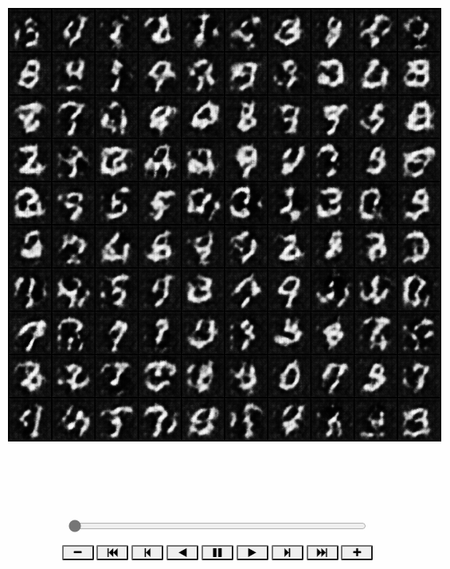

# 1. Target
Based on the mnist dataset, we will train a `dcgan` to generate new handwritten digit.
# 2. Environment
## 2.1. Python
download: [https://www.python.org/downloads/](https://www.python.org/downloads/)
## 2.2. Pytorch
download: [https://pytorch.org/get-started/locally/](https://pytorch.org/get-started/locally/)
## 2.3. Jupyter notebook
```bash
pip install jupyter
```
## 2.4. Matplotlib
```bash
pip install matplotlib
```
# 3. Implementation
## 3.1. Generator
### 3.1.1 Structure of Generator


### 3.1.2 Code
```python
class Generator(nn.Module):
    def __init__(self, ngpu):
        super(Generator, self).__init__()
        self.ngpu = ngpu
        self.main = nn.Sequential(
            # input is Z, going into a convolution
            nn.ConvTranspose2d(nz, ngf * 8, 4, 1, 0, bias=False),
            nn.BatchNorm2d(ngf * 8),
            nn.ReLU(True),
            # state size. (ngf*8) x 4 x 4
            nn.ConvTranspose2d(ngf * 8, ngf * 4, 4, 2, 1, bias=False),
            nn.BatchNorm2d(ngf * 4),
            nn.ReLU(True),
            # state size. (ngf*4) x 8 x 8
            nn.ConvTranspose2d(ngf * 4, ngf * 2, 4, 2, 1, bias=False),
            nn.BatchNorm2d(ngf * 2),
            nn.ReLU(True),
            # state size. (ngf*2) x 16 x 16
            nn.ConvTranspose2d(ngf * 2, ngf, 4, 2, 1, bias=False),
            nn.BatchNorm2d(ngf),
            nn.ReLU(True),
            # state size. (ngf) x 32 x 32
            nn.ConvTranspose2d(ngf, nc, 4, 2, 1, bias=False),
            nn.Tanh()
            # state size. (nc) x 64 x 64
        )

    def forward(self, input):
        return self.main(input)
```
### 3.1.3. Instantiation of Generator
```python
# Create the generator
netG = Generator(ngpu).to(device)

# Handle multi-gpu if desired
if device.type == 'cuda' and ngpu > 1:
    netG = nn.DataParallel(netG, list(range(ngpu)))

# Apply the weights_init function to randomly initialize all weights to mean=0, stdev=0.2.
# netG.apply(weights_init)
```
## 3.2. Discriminator
### 3.2.1. Structure of Discriminator


### 3.2.2. Code
```python
class Discriminator(nn.Module):
    def __init__(self, ngpu):
        super(Discriminator, self).__init__()
        self.ngpu = ngpu
        self.main = nn.Sequential(
            # input is (nc) x 64 x 64
            nn.Conv2d(nc, ndf, 4, 2, 1, bias=False),
            nn.LeakyReLU(0.2, inplace=True),
            # state size. (ndf) x 32 x 32
            nn.Conv2d(ndf, ndf * 2, 4, 2, 1, bias=False),
            nn.BatchNorm2d(ndf * 2),
            nn.LeakyReLU(0.2, inplace=True),
            # state size. (ndf*2) x 16 x 16
            nn.Conv2d(ndf * 2, ndf * 4, 4, 2, 1, bias=False),
            nn.BatchNorm2d(ndf * 4),
            nn.LeakyReLU(0.2, inplace=True),
            # state size. (ndf*4) x 8 x 8
            nn.Conv2d(ndf * 4, ndf * 8, 4, 2, 1, bias=False),
            nn.BatchNorm2d(ndf * 8),
            nn.LeakyReLU(0.2, inplace=True),
            # state size. (ndf*8) x 4 x 4
            nn.Conv2d(ndf * 8, 1, 4, 1, 0, bias=False),
            # state size. (1) x 1 x 1
            nn.Sigmoid()
        )

    def forward(self, input):
        return self.main(input)
```
### 3.2.3. Instantiation of Discriminator
```python
# Create the Discriminator
netD = Discriminator(ngpu).to(device)

# Handle multi-gpu if desired
if device.type == 'cuda' and ngpu > 1:
    netD = nn.DataParallel(netD, list(range(ngpu)))

# Apply the weights_init function to randomly initialize all weights to mean=0, stdev=0.2.
# netD.apply(weights_init)
```
## 3.3. Training Result
```python
Starting Training Loop...
Epoch: [01/10] Step: [700/700] Loss-D: 0.6744 Loss-G: 1.0026 D(x): 0.5789 D(G(z)): [0.0638/0.4204] Time: 114s
Epoch: [02/10] Step: [700/700] Loss-D: 2.2584 Loss-G: 3.7674 D(x): 0.9661 D(G(z)): [0.8334/0.0440] Time: 166s
Epoch: [03/10] Step: [700/700] Loss-D: 1.2438 Loss-G: 0.8505 D(x): 0.4126 D(G(z)): [0.1107/0.4717] Time: 166s
Epoch: [04/10] Step: [700/700] Loss-D: 0.3479 Loss-G: 2.5261 D(x): 0.8771 D(G(z)): [0.1796/0.0980] Time: 166s
Epoch: [05/10] Step: [700/700] Loss-D: 0.6771 Loss-G: 3.8938 D(x): 0.9139 D(G(z)): [0.3889/0.0277] Time: 161s
Epoch: [06/10] Step: [700/700] Loss-D: 0.2697 Loss-G: 3.8211 D(x): 0.9490 D(G(z)): [0.1823/0.0282] Time: 166s
Epoch: [07/10] Step: [700/700] Loss-D: 0.2874 Loss-G: 2.1176 D(x): 0.8062 D(G(z)): [0.0494/0.1503] Time: 180s
Epoch: [08/10] Step: [700/700] Loss-D: 0.7798 Loss-G: 1.6315 D(x): 0.5978 D(G(z)): [0.1508/0.2463] Time: 171s
Epoch: [09/10] Step: [700/700] Loss-D: 0.3052 Loss-G: 0.8984 D(x): 0.7611 D(G(z)): [0.0023/0.4799] Time: 165s
Epoch: [10/10] Step: [700/700] Loss-D: 1.1115 Loss-G: 2.2473 D(x): 0.7334 D(G(z)): [0.4824/0.1385] Time: 157s
```
## 3.4. Loss versus training iteration


## 3.5. D(x) and D(G(z)) versus training iteration


## 3.15. Visualization of G’s progression


# 4. Real Images vs. Fake Images


# 5. Cite
> [https://pytorch.org/tutorials/beginner/dcgan_faces_tutorial.html](https://pytorch.org/tutorials/beginner/dcgan_faces_tutorial.html)

# 6. Paper
UNSUPERVISED REPRESENTATION LEARNING WITH DEEP CONVOLUTIONAL GENERATIVE ADVERSARIAL NETWORKS: [Download](https://papers.nips.cc/paper/5423-generative-adversarial-nets.pdf)

# 7.Tips
For Chinese, you can look my csdn blog: [https://blog.csdn.net/qq_42951560/article/details/112199229](https://blog.csdn.net/qq_42951560/article/details/112199229)
